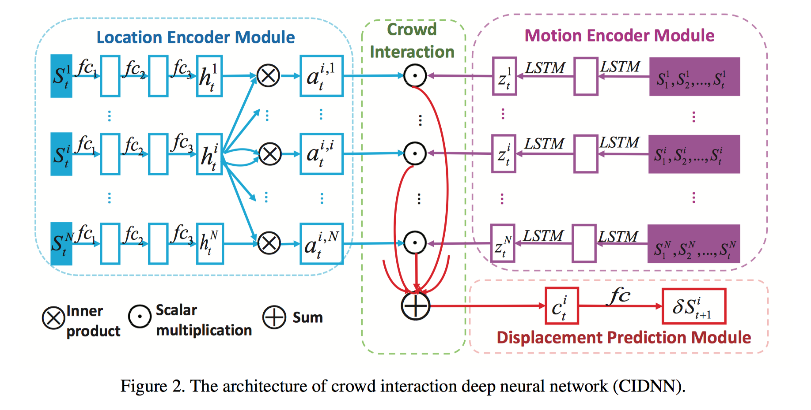

# CIDNN 
CIDNN: Encoding Crowd Interaction with Deep Neural Network 

This repo is the official open source of CIDNN, CVPR 2018 by Yanyu Xu, Zhixin Piao and Shenghua Gao. 



It is implemented in Pytorch 0.4 and Python 3.x.

If you find this useful, please cite our work as follows:

```
@INPROCEEDINGS{xu2018cidnn, 
	author={Yanyu Xu and Zhixin Piao and Shenghua Gao}, 
	booktitle={2018 IEEE Conference on Computer Vision and Pattern Recognition (CVPR)}, 
	title={Encoding Crowd Interaction with Deep Neural Network for Pedestrian Trajectory Prediction}, 
	year={2018}
}
```

## DataSet

|      DataSet       |                             Link                             |
| :----------------: | :----------------------------------------------------------: |
|       GC [1]       | [BaiduYun](https://pan.baidu.com/s/1dD0EmXF) or [DropBox](https://www.dropbox.com/s/7y90xsxq0l0yv8d/cvpr2015_pedestrianWalkingPathDataset.rar?dl=0) |
|      ETH [2]       | [website](http://www.vision.ee.ethz.ch/~stefpell/lta/index.html) |
|      UCY [3]       | [website](https://graphics.cs.ucy.ac.cy/research/downloads/crowd-data) |
|   CUHK Crowd [4]   | [webiste](http://www.ee.cuhk.edu.hk/~jshao/projects/CUHKcrowd_files/cuhk_crowd_dataset.htm) or [BaiduYun](cuhk_crowd.md) |
| subway station [5] | [website](http://www.ee.cuhk.edu.hk/~xgwang/grandcentral.html) |

**Update 2019.07.17**: Because the website of GC Dataset has been deleted, here we give the download link and decription of it.

**GC Dataset Description:**

> 1. This dataset contains two folders, naming ‘Annotation’ and ‘Frame’, respectively.
>
> 2. The ‘Annotation’ folder contains the manually labeled walking paths of 12,684 pedestrians. Annotations are named as ‘XXXXXX.txt’. ‘XXXXXX’ is pedestrian index.
>
> 3. For each of the annotation txt file. It contains multiple integers, corresponding to the (x,y,t)s of the current pedestrian. ‘x’ and ‘y’ are point coordinates and ‘t’ is frame index. There should be 3N integers if this pedestrian appears in N frames. All pedestrians within Frame 000000 to 100000 are labeled from the time point he(she) arrives to the time point he(she) leaves.
>
> 4. The ‘Frame’ folder contains 6001 frames sampled from a surveillance video captured at the Grand Central Train Station of New York. These frames are named as ‘XXXXXX.jpg’. ‘XXXXXX’ is frame index. It starts from ‘000000’ and ends at ‘120000’. One frame is sampled every 20 frames from the surveillance video clip.

## Pipeline
1. download dataset and set it in `CIDNN/data` dir:
```
CIDNN/data/GC # for example, we use GC dataset
```
2. open `tools/create_dataset.py` and set data path:
```
GC_raw_data_path = 'data/GC/Annotation'
GC_meta_data_path = 'data/GC_meta_data.json'
GC_train_test_data_path = 'data/GC.npz'
```
where `GC_raw_data_path` is GC dataset we has downloaded, `GC_meta_data_path` is an intermediate file to help create `GC.npz`, which is final data we use for our network.

3. build `GC.npz`:
```
cd CIDNN
python tools/create_dataset.py
```
you will get this output:
```
pedestrian_data_list size:  12685
frame_data_list size:  6001
create data/GC_meta_data.json successfully!
float32
train_X: (11630, 20, 5, 2), train_Y: (11630, 20, 5, 2)
test_X: (1306, 20, 5, 2), test_Y: (1306, 20, 5, 2)
create data/GC.npz successfully!
```
It means that GC.npz has four part: `train_X`, `train_Y`, `test_X`, `test_Y`. `X` means observed trace, `Y` means predicted trace. 
each data has structure like (batch_num, pedestrian_num, obv_frame / pred_frame, dim)

for example, train_X(11630, 20, 5, 2) means there are 11630 samples, each sample has 20 pedestrians in the same 2d scene, we observe 5 frame.


4. train CIDNN (all hyper-parameter in Class Model) and do whatever you want:
```
python train.py
```

## Reference

1. **Understanding Pedestrian Behaviors from Stationary Crowd Groups**

   Shuai Yi, Hongsheng Li, and Xiaogang Wang.  In CVPR, 2015.

2. **You’ll never walk alone: Modeling social behavior for multi-target tracking**

   Stefano Pellegrini, Andreas Ess, Konrad Schindler, Luc Van Gool. In ICCV 2009.

3. **Crowds by Example**

   Alon Lerner, Yiorgos Chrysanthou, Dani Lischinski. In EUROGRAPHICS 2007.

4. **Scene-Independent Group Profiling in Crowd**

   Jing Shao, Chen Change Loy, Xiaogang Wang. In CVPR 2014.

5. **Understanding Collective Crowd Behaviors: Learning a Mixture Model of Dynamic Pedestrian-Agents**

   Bolei Zhou, Xiaogang Wang, Xiaoou Tang. In CVPR 2012.

